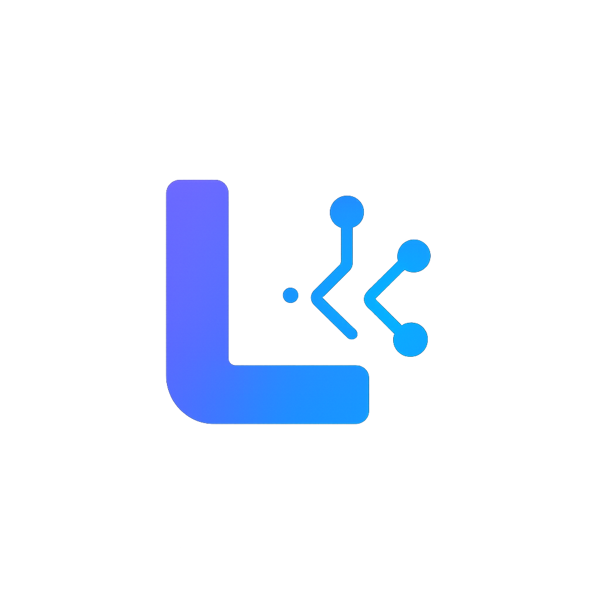

<div align="center">



**AI-powered code editor. Bring your own API keys.**

[](LICENSE)
[](https://python.org)
[](https://react.dev)
[](https://fastapi.tiangolo.com)
[](https://typescriptlang.org)
[](https://langchain-ai.github.io/langgraph/)

[Demo](#demo) &middot; [Quick Start](#quick-start) &middot; [Architecture](#architecture) &middot; [Contributing](CONTRIBUTING.md)

---

</div>

## What is Lumnicode?

Lumnicode is an online code editor with built-in AI assistance. Unlike other AI coding tools, you connect **your own API keys** from any supported provider -- no subscriptions, no per-seat pricing, no vendor lock-in.

**Key highlights:**

- **Multi-provider AI** -- OpenAI, Anthropic, Google Gemini, Groq, Together, Fireworks, Cohere
- **BYOK (Bring Your Own Keys)** -- use your existing API keys, pay only for what you use
- **Monaco Editor** -- VS Code-level editing with syntax highlighting, intellisense, and themes
- **AI Command Palette** -- `Cmd+K` for explain, refactor, complete, find bugs, generate tests
- **Streaming responses** -- token-by-token AI output via Server-Sent Events
- **LangGraph orchestration** -- AI project generation with plan-config-generate-finalize pipeline
- **S3 file storage** -- MinIO in development, any S3-compatible service in production
- **Real-time updates** -- WebSocket-driven progress for AI generation

## Demo

<div align="center">

| Landing Page | Code Editor |
|:---:|:---:|
| Dark, minimal landing with indigo accents | Monaco editor with AI panel and command palette |

</div>

> Screenshots coming soon. Run locally to see the full experience.

## Quick Start

### Prerequisites

- [Docker Desktop](https://www.docker.com/products/docker-desktop/) (for Postgres + MinIO)
- [Node.js](https://nodejs.org/) 20+
- [Python](https://www.python.org/) 3.11+
- [uv](https://docs.astral.sh/uv/) (Python package manager)

### 1. Clone and start infrastructure

```bash
git clone https://github.com/martian56/lumnicode.git
cd lumnicode
docker-compose -f docker-compose.dev.yml up -d
```

This starts **PostgreSQL** (port 5432) and **MinIO** (ports 9000/9001).

### 2. Start the backend

```bash
cd backend
cp .env.example .env   # Edit with your Clerk keys
uv sync
uv run alembic upgrade head
uv run uvicorn main:app --reload --host 0.0.0.0 --port 8000
```

### 3. Start the frontend

```bash
cd frontend
cp .env.example .env   # Edit with your Clerk publishable key
npm install
npm run dev
```

### 4. Open the app

Visit **http://localhost:5173**, sign in with Clerk, add your AI API key in Settings > API Keys, and start coding.

## Architecture

```
                         +------------------+
                         |    React SPA     |
                         |   (Vite + TS)    |
                         +--------+---------+
                                  |
                    REST / SSE / WebSocket
                                  |
                         +--------+---------+
                         |    FastAPI       |
                         |   (Python)       |
                         +--------+---------+
                                  |
              +-------------------+-------------------+
              |                   |                   |
     +--------+------+   +-------+-------+   +-------+-------+
     |   PostgreSQL  |   |  MinIO (S3)   |   |  AI Providers |
     |  (metadata)   |   | (file content)|   | (LangChain)   |
     +---------------+   +---------------+   +---------------+
```

### Backend Stack

| Component | Technology | Purpose |
|---|---|---|
| Web framework | FastAPI | REST API, WebSocket, SSE |
| Database | PostgreSQL + SQLAlchemy | Users, projects, file metadata |
| File storage | S3 / MinIO (boto3) | File content storage |
| AI providers | LangChain + LangGraph | Multi-provider AI abstraction |
| Auth | Clerk (JWT) | User authentication |
| Migrations | Alembic | Database schema management |
| Package manager | uv | Fast Python dependency management |

### Frontend Stack

| Component | Technology | Purpose |
|---|---|---|
| Framework | React 19 + TypeScript | UI rendering |
| Build tool | Vite 7 | Development server and bundling |
| Code editor | Monaco Editor | VS Code-grade code editing |
| Styling | Tailwind CSS 4 | Utility-first styling |
| Auth | Clerk React | Sign-in/sign-up flows |
| HTTP | Axios | REST API calls |
| Streaming | Fetch + ReadableStream | SSE consumption |

### AI Architecture

```
User Request
     |
     v
LLM Provider Factory (llm_provider.py)
     |
     +-- ChatOpenAI        (OpenAI, Together, Fireworks, Groq)
     +-- ChatAnthropic     (Claude)
     +-- ChatGoogleGenAI   (Gemini)
     |
     v
LangGraph State Machine (generation_graph.py)
     |
     +-- plan_node       --> Analyze requirements, plan file structure
     +-- config_node     --> Generate package.json, tsconfig, etc.
     +-- generate_node   --> Generate source files, write to S3
     +-- finalize_node   --> Update project, mark complete
     |
     v
WebSocket Progress Updates --> Frontend
```

### Supported AI Providers

| Provider | Models | API Type |
|---|---|---|
| OpenAI | GPT-4o, GPT-4o-mini | Native |
| Anthropic | Claude 3.5 Sonnet, Claude 3 Haiku | Native |
| Google | Gemini 1.5 Pro, Gemini 1.5 Flash | Native |
| Groq | Llama 3.1 70B | OpenAI-compatible |
| Together | Llama 3 70B | OpenAI-compatible |
| Fireworks | Llama 3.1 70B | OpenAI-compatible |
| Cohere | Command R | OpenAI-compatible |


## Configuration

### Environment Variables

**Backend (`backend/.env`):**

| Variable | Required | Default | Description |
|---|---|---|---|
| `DATABASE_URL` | Yes | - | PostgreSQL connection string |
| `CLERK_SECRET_KEY` | Yes | - | Clerk authentication secret |
| `CLERK_PUBLISHABLE_KEY` | Yes | - | Clerk authentication public key |
| `S3_ENDPOINT_URL` | No | `http://localhost:9000` | S3/MinIO endpoint |
| `S3_ACCESS_KEY` | No | `lumnicode` | S3 access key |
| `S3_SECRET_KEY` | No | `lumnicode123` | S3 secret key |
| `S3_BUCKET_NAME` | No | `lumnicode-files` | S3 bucket name |

**Frontend (`frontend/.env`):**

| Variable | Required | Description |
|---|---|---|
| `VITE_CLERK_PUBLISHABLE_KEY` | Yes | Clerk publishable key |
| `VITE_API_BASE_URL` | No | Backend URL (default: `http://localhost:8000`) |

## API Documentation

Once the backend is running, access the interactive API docs:

- **Swagger UI:** http://localhost:8000/docs
- **ReDoc:** http://localhost:8000/redoc

### Key Endpoints

| Method | Endpoint | Description |
|---|---|---|
| `POST` | `/assist` | AI code assistance |
| `POST` | `/assist/stream` | Streaming AI responses (SSE) |
| `GET` | `/projects` | List user projects |
| `POST` | `/projects` | Create project |
| `GET` | `/files?project_id=X` | List project files |
| `POST` | `/files` | Create file (stored in S3) |
| `POST` | `/ai/generate/{id}` | Start AI project generation |
| `WS` | `/ws/ai-progress/{id}` | Real-time generation progress |

## Development

```bash
# Backend
cd backend
uv run black .              # Format
uv run ruff check .         # Lint
uv run pytest               # Test

# Frontend
cd frontend
npm run lint                 # Lint
npm run build                # Type check + build
```

### Database Migrations

```bash
cd backend
uv run alembic revision --autogenerate -m "describe change"
uv run alembic upgrade head
```

### MinIO Console

Access the MinIO web console at http://localhost:9001 (user: `lumnicode`, password: `lumnicode123`) to browse stored files.

## Deployment

### Docker (Recommended)

```bash
# Set required environment variables
export POSTGRES_PASSWORD=your_secure_password
export S3_ACCESS_KEY=your_s3_key
export S3_SECRET_KEY=your_s3_secret

# Start all services
docker-compose up --build -d
```

### Manual

Deploy the backend and frontend separately to any platform that supports Python/Node.js. Point `S3_ENDPOINT_URL` to your S3-compatible storage (AWS S3, DigitalOcean Spaces, Cloudflare R2, etc).

## Roadmap

- [ ] Real-time collaboration (multi-user editing)
- [ ] Git integration (clone, commit, push from editor)
- [ ] Terminal emulator
- [ ] Plugin system
- [ ] Self-hosted deployment guide
- [ ] Mobile responsive editor

## Contributing

Contributions are welcome! See [CONTRIBUTING.md](CONTRIBUTING.md) for guidelines.

1. Fork the repository
2. Create your feature branch (`git checkout -b feature/amazing-feature`)
3. Commit your changes
4. Push to the branch
5. Open a Pull Request

## Star History

<div align="center">

[](https://star-history.com/#martian56/lumnicode&Date)

</div>

## Contributors

<a href="https://github.com/martian56/lumnicode/graphs/contributors">
  
</a>

## License

This project is licensed under the MIT License -- see the [LICENSE](LICENSE) file for details.

---

<div align="center">

**[Website](https://lumnicode.dev)** &middot; **[Documentation](https://github.com/martian56/lumnicode/wiki)** &middot; **[Report Bug](https://github.com/martian56/lumnicode/issues/new?template=bug_report.md)** &middot; **[Request Feature](https://github.com/martian56/lumnicode/issues/new?template=feature_request.md)**

Built with FastAPI, React, LangGraph, and MinIO.

</div>
